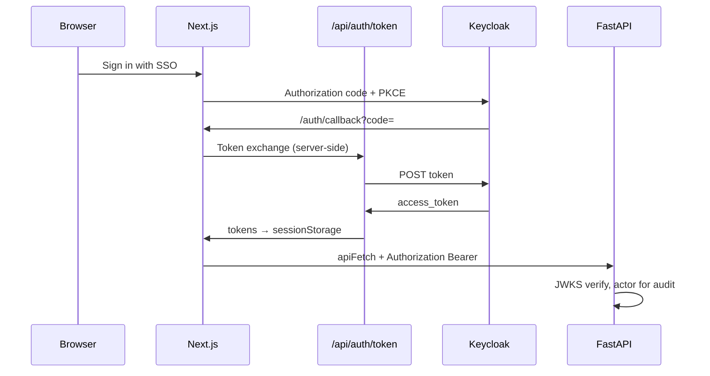

# Ontology-Teleology Studio — Architecture Specification

**Version:** 2026-07-12 · **Repo:** [AqlaarTeleologyStudio](https://github.com/bobbyaqlaar/AqlaarTeleologyStudio)

This document describes how OTS is structured across functional and non-functional layers, which components exist, and how they integrate to deliver consultant workshops, discovery analysis, and transformation design.

---

## 1. Purpose and scope

OTS is a consultant platform for enterprise digital transformation. It holds industry-standard **process** (BPMN), **ontology** (OWL), and **teleology** (goals/gaps/ambitions) baselines; captures client-specific customizations through workshops and system connectors; and uses **drafting agents** to propose artefacts that humans verify before acceptance.

**In scope (shipped):**

- Five value streams: O2C, P2P, C2M, H2R, T2R
- Industry baselines: generic (APQC PCF) and telecom (TM Forum eTOM)
- Postgres persistence, Fuseki semantic store, OpenRouter-primary LLM agents
- Alignment scoring, gap-bridge options, cross-stream initiatives, workshop presenter
- Audit trail, PDF export, OIDC SSO (Keycloak dev realm)

**Out of scope (post-v1):** autonomous unsupervised agents, quarterly standards crawl, SHACL enforcement in production, vertical ontologies beyond telecom seed.

---

## 2. Layered architecture

```
┌─────────────────────────────────────────────────────────────────────────┐
│  PRESENTATION — Next.js 16 (apps/web)                                   │
│  App Router · React 19 · bpmn-js · React Flow · shadcn/base-ui          │
└───────────────────────────────┬─────────────────────────────────────────┘
                                │ HTTPS / fetch (Bearer + demo headers)
┌───────────────────────────────▼─────────────────────────────────────────┐
│  APPLICATION — FastAPI (services/api)                                     │
│  Routers: engagements, process, ontology, teleology, gaps, agents,      │
│           alignment, solutions, connectors, audit, export               │
│  Cross-cutting: auth (OIDC JWT), audit writer, llm.py                   │
└───────┬─────────────────────┬──────────────────────┬────────────────────┘
        │                     │                      │
        ▼                     ▼                      ▼
┌───────────────┐   ┌─────────────────┐   ┌─────────────────────────────┐
│  Postgres     │   │  Apache Fuseki  │   │  LLM providers              │
│  relational   │   │  OWL/RDF graphs │   │  OpenRouter (primary)       │
│  state        │   │  + SKOS thesaurus│   │  Anthropic Claude (fallback)│
└───────────────┘   └─────────────────┘   └─────────────────────────────┘
        ▲                     ▲
        │                     │
┌───────┴─────────────────────┴───────────────────────────────────────────┐
│  INGESTION — services/ingest (uv CLI: ots-ingest)                       │
│  APQC xlsx/PDF · TM Forum MODA → TTL + BPMN + SKOS thesaurus            │
└─────────────────────────────────────────────────────────────────────────┘
        ▲
┌───────┴───────────────────────────────────────────────────────────────────┐
│  REFERENCE DATA — ReferenceDocs/, data/baselines/, data/thesaurus/       │
└───────────────────────────────────────────────────────────────────────────┘
```

### 2.1 Functional layers

| Layer | Responsibility | Primary artefacts |
|-------|----------------|-------------------|
| **Engagement** | Client project shell, progress, participants | `engagements`, `value_streams` |
| **Streams** | Which journeys apply; baseline load per stream | Baseline TTL/BPMN from `data/baselines/{industry}/` |
| **Process** | BPMN customization, function tags, systems | `process_states.bpmn_xml`, `element_meta` |
| **Ontology** | OWL graph per stream, class editor, BPMN links, thesaurus map | Fuseki graph `urn:ots:engagement:{id}:stream:{stream}` |
| **Teleology** | Goals, gaps, ambitions vs org themes | `teleology_rows` |
| **Discovery** | Current vs desired alignment, evidence join | `GET /alignment/{eng}` |
| **Solutions** | Stream-scoped options + cross-stream initiatives | `solution_options`, `initiatives` |
| **Workshop** | Same-screen presenter over process → ontology → teleology | Reads process + Fuseki + teleology live |
| **Connectors** | Salesforce/Jira preview → pre-fill process meta | `connector_*` tables |
| **Governance** | Review queue, audit, PDF export | `audit_events`, reportlab PDF |

### 2.2 Non-functional layers

| Concern | Implementation |
|---------|----------------|
| **Persistence** | Postgres 17 (Alembic migrations); Fuseki 5.1 named graphs |
| **Availability** | Fetch-first web services; mock fallback for engagement/process/teleology when API offline |
| **Security** | OIDC PKCE (web) + RS256 JWT verification (API); `OTS_AUTH_MODE` off/optional/required |
| **Observability** | Append-only `audit_events` on every mutation; CSV export |
| **AI resilience** | `llm.py`: OpenRouter first, Claude fallback; heuristics always for gap analysis |
| **Multi-tenancy** | Engagement-scoped rows and Fuseki graph URIs |
| **UX** | Dark/light, dense SaaS layout, role-aware edit vs approve, guided stepper |

---

## 3. Component map

### 3.1 Frontend (`apps/web`)

| Area | Route | Key components | Backend dependency |
|------|-------|----------------|-------------------|
| Shell | All except workshop | `app-shell`, `app-sidebar`, `engagement-stepper`, `role-switcher` | `engagements/progress` |
| Streams | `/engagements/[id]/streams` | `stream-grid`, `agent-trigger-banner` | `engagements/load-baseline` |
| Process | `…/streams/[stream]/process` | `bpmn-editor`, `function-tag-panel`, `gap-suggestions-drawer` | `process`, `gaps` |
| Ontology | `…/streams/[stream]/ontology` | `owl-graph-viewer`, `thesaurus-panel`, `ai-link-suggestions-panel` | `ontology` (Fuseki) |
| Teleology | `/engagements/[id]/teleology` | `teleology-workspace`, matrix + drill-down | `teleology` |
| Alignment | `/engagements/[id]/alignment` | `alignment-heatmap`, `solution-option-card` | `alignment`, `agents/bridge-gaps` |
| Initiatives | `/engagements/[id]/initiatives` | `initiative-card`, `initiative-linkage` | `agents/draft-initiatives`, `solutions` |
| Workshop | `/engagements/[id]/workshop` | `workshop-workspace`, slides, parking lot | process + ontology + teleology + alignment |
| Connectors | `/engagements/[id]/connectors` | `connectors-workspace` | `connectors` (API-only) |
| Review | `/engagements/[id]/review` | `review-queue-table` | teleology + streams + comments |
| Audit | `/engagements/[id]/audit` | `audit-trail-workspace` | `audit` |
| Auth | `/auth/callback` | OIDC completion | `/api/auth/token` → Keycloak |

**Service boundary:** `lib/api/*` talks to FastAPI (no mock). `lib/mock/services/*` is fetch-first with in-memory fallback for UI-only dev.

### 3.2 API (`services/api`)

| Router | Prefix | Integrates with |
|--------|--------|-----------------|
| `engagements_router` | `/api/v1/engagements` | Postgres; triggers Fuseki init on baseline load |
| `process_router` | `/api/v1/process` | Postgres BPMN + element meta |
| `ontology_router` | `/api/v1/ontology` | Fuseki SPARQL; baseline TTL from disk |
| `teleology_router` | `/api/v1/teleology` | Postgres matrix |
| `comments_router` | `/api/v1/comments` | Postgres threads |
| `gaps_router` | `/api/v1/gaps` | Postgres process + Fuseki labels + `llm.py` |
| `agents_router` | `/api/v1/agents` | Postgres + Fuseki context + `llm.py` |
| `alignment_router` | `/api/v1/alignment` | Postgres teleology/process + Fuseki mappings + goal links |
| `solutions_router` | `/api/v1/solutions` | `solution_options`, `initiatives` lifecycle |
| `connectors_router` | `/api/v1/connectors` | Postgres + live Jira/Salesforce HTTP |
| `audit` | `/api/v1/audit` | Read-only audit log |
| `export_router` | `/api/v1/engagements/.../export.pdf` | Postgres snapshot + reportlab |

### 3.3 Ingestion (`services/ingest`)

Deterministic pipeline from `ReferenceDocs/` to emitted artefacts:

```
parse-apqc / parse-moda / parse-industry
        → cache (JSONL)
        → emit --industry generic|telecom --stream o2c|…|all
        → data/baselines/{industry}/{stream}.{ttl,bpmn}
        → data/thesaurus/{apqc,etom,sid}.ttl
        → validate (acyclic precedes, labels, function units)
```

Human-editable maps: `mapping/streams.yaml`, `mapping/alignments/apqc-etom.yaml`.

### 3.4 Infrastructure (`docker-compose.yml`, `infra/`)

| Service | Port | Role |
|---------|------|------|
| `postgres` | 5434→5432 | Engagement and artefact state |
| `fuseki` | 3030 | OWL/RDF + SPARQL |
| `keycloak` | 8081 | Dev OIDC IdP (`infra/keycloak/ots-realm.json`) |
| `api` | 8000 | Optional containerized FastAPI |

---

## 4. Data model integration

### 4.1 Postgres (relational truth)

| Table | Written by | Read by |
|-------|------------|---------|
| `engagements` / `value_streams` | Engagement create, baseline load, approval | Stepper, review, workshop |
| `process_states` | BPMN save, element tag, connector apply, AI tag accept | Process UI, gaps, agents, alignment |
| `teleology_rows` | Consultant edit, agent draft, option accept | Teleology, alignment, review |
| `process_comments` | Workshop parking lot, process comments | Review queue |
| `solution_options` / `initiatives` | Bridge-gaps / draft-initiatives agents | Alignment, initiatives, review |
| `connector_*` | Connect, mapping PATCH, apply | Connectors workspace |
| `audit_events` | All mutating routers | Audit UI, compliance export |

### 4.2 Fuseki (semantic truth)

**Per engagement stream:**

```
urn:ots:engagement:{engagementId}:stream:{streamType}
```

Triples include: `rdfs:label`, `ots:functionUnit`, `ots:precedes`, `ots:linkedBpmnElement`, `ots:mapsToConcept`, `ots:supportsGoal`.

**Thesaurus (shared, lazy-loaded):**

```
urn:ots:thesaurus:apqc | etom | sid
```

Initialized from `data/thesaurus/*.ttl` on first search or mapping.

### 4.3 Cross-store joins (alignment report)

`GET /api/v1/alignment/{eng}` deterministically scores each function unit 0–100 by joining:

- Teleology ambitions/goals (Postgres)
- Tagged steps and systems (Postgres `element_meta`)
- Ontology class labels and thesaurus mappings (Fuseki)
- Goal traceability links `ots:supportsGoal` (Fuseki)

Agents and workshop wrap-up consume the same report.

---

## 5. Agent and LLM integration

All agents share `services/api/llm.py`:

1. **Primary:** OpenRouter (`OPENROUTER_API_KEY`, model `OTS_LLM_MODEL` default `openrouter/auto`)
2. **Fallback:** Anthropic Claude (`ANTHROPIC_API_KEY`, `OTS_LLM_FALLBACK_MODEL`)
3. **Failure:** `LlmUnavailable` — gap analysis degrades to heuristics; drafting endpoints return error to UI

| Agent | Trigger | Endpoint | Output |
|-------|---------|----------|--------|
| Gap analysis | Manual (drawer refresh) | `POST /gaps/{eng}/{stream}/analyze` | Suggestions in UI drawer |
| Draft teleology | Button | `POST /agents/{eng}/{stream}/draft-teleology` | Postgres teleology rows |
| Draft process tags | Button **or** baseline load event | `POST /agents/.../draft-process-tags` | `element_meta.aiSuggestion` |
| Draft ontology links | Button **or** graph ready event | `POST /agents/.../draft-ontology-links` | Stateless proposals in UI |
| Bridge gaps | Button on alignment | `POST /agents/.../bridge-gaps` | `solution_options` |
| Draft initiatives | Button (≥2 streams loaded) | `POST /agents/{eng}/draft-initiatives` | `initiatives` |

**Event triggers (web):** `agent-trigger-service.ts` debounces 60s per engagement+stream; shows `AgentTriggerBanner` on completion.

Every agent mutation is audit-logged (`agent.*` events).

---

## 6. Feature integration flows

### 6.1 Consultant workshop journey

```
Create engagement → Load baselines → [auto draft tags]
    → Process map (tag, systems, gap drawer)
    → Ontology (map thesaurus, goal links, [auto draft links])
    → Teleology (goals, submit)
    → Alignment (heatmap, bridge gaps)
    → Initiatives (cross-stream draft)
    → Workshop (present, parking lot)
    → Review (stakeholder approve)
    → PDF + audit export
```

### 6.2 Stakeholder verification

Stakeholders (SSO role `stakeholder` or dev switcher) comment on BPMN steps and approve teleology/stream items in **Review**. Consultants resolve feedback and iterate.

### 6.3 Admin / operator journey

```
docker compose up → API + web → verify /health
    → Ensure OPENROUTER_API_KEY in .env
    → (Optional) ots-ingest emit after ReferenceDocs update
    → Keycloak users/roles for SSO
    → Monitor audit trail; connector creds for live CRM/ticket preview
```

---

## 7. Authentication integration



Dev users: `alex/alex` (consultant), `jordan/jordan` (stakeholder).

---

## 8. Deployment topology (local / demo)

| Process | Command | URL |
|---------|---------|-----|
| Infra | `docker compose up -d postgres fuseki keycloak` | — |
| API | `uv run … uvicorn main:app --app-dir services/api --port 8000` | :8000 |
| Web | `cd apps/web && npm run dev` | :3001 |
| E2E | `cd apps/web && npm run test:e2e` | :3100 (auto) |

**Demo seed:** `eng-acme-001` (Acme Corp, O2C loaded, review items pending).

---

## 9. Environment variables (integration contract)

| Variable | Layer | Purpose |
|----------|-------|---------|
| `OTS_DATABASE_URL` | API | Postgres |
| `FUSEKI_URL`, `FUSEKI_*` | API | Semantic store |
| `OTS_BASELINE_DIR`, `OTS_THESAURUS_DIR` | API | On-disk baselines |
| `OPENROUTER_API_KEY`, `OTS_LLM_MODEL` | API | Primary LLM |
| `ANTHROPIC_API_KEY`, `OTS_LLM_FALLBACK_MODEL` | API | Fallback LLM |
| `OTS_OIDC_ISSUER`, `OTS_AUTH_MODE` | API | JWT verification |
| `OTS_JIRA_*`, `OTS_SF_*` | API | Live connectors |
| `NEXT_PUBLIC_OTS_API_URL` | Web | API base |
| `NEXT_PUBLIC_OTS_OIDC_*` | Web | SSO client |

---

## 10. Related documents

| Document | Purpose |
|----------|---------|
| [user_manual.md](./user_manual.md) | Step-by-step usage for consultants and admins |
| [DemoScript.md](./DemoScript.md) | Recording script for demos; validated by E2E |
| [TODO-implementation-plan.md](./TODO-implementation-plan.md) | Implementation history and backlog |
| [superpowers/specs/2026-06-11-ots-phase1-design.md](./superpowers/specs/2026-06-11-ots-phase1-design.md) | Phase 1 UX and workflow spec |
| [superpowers/specs/2026-07-11-workshop-alignment-gap-bridge-design.md](./superpowers/specs/2026-07-11-workshop-alignment-gap-bridge-design.md) | Phase 2 alignment and workshop spec |
